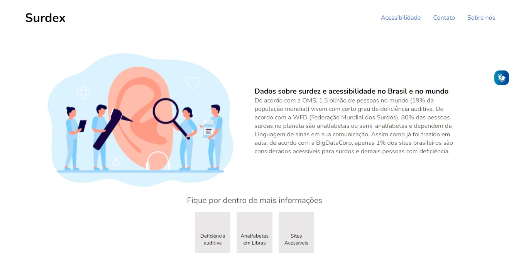

#  Surdez

 

## Objetivo do Projeto 🎯
O projeto tem como objetivo exemplificar a utilização de uma ferramenta para auxiliar PcD (pessoa com deficiência) a ter uma experiência perfeita com a garantia de acessibilidade. 

## Responsáveis Técnicos 🤝

<table>
  <tr>
    <td align="center">
      <a href="https://github.com/VALMIR-DE-OLIVEIRA-FILHO">
         
        
          <b style="font-size: 13px;">Valmir de Oliveira Filho</b>
        
      </a>
    </td>
    <td align="center">
      <a href="https://github.com/petrinks">
         
        
          <b style="font-size: 13px;">Pedro Petrini</b>
        
      </a>
    </td>
    <td align="center">
      <a href="https://github.com/olucaspk">
         
        
          <b style="font-size: 13px;">Lucas Silva</b>
        
      </a>
    </td>
    <td align="center">
      <a href="https://github.com/Guibarbieri2006">
         
        
          <b style="font-size: 13px;">Guilherme Barbieri</b>
        
      </a>
    </td>